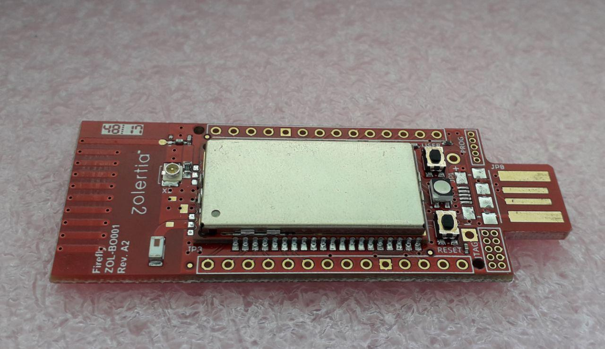

# LWB-CC2538

This work implements [Low-power Wireless Bus (LWB)](http://doi.acm.org/10.1145/2426656.2426658) for TI's [CC2538](http://www.ti.com/product/CC2538) Soc for [Contiki OS](http://www.contiki-os.org). LWB is a communication protocol for low-power wireless networks that abstracts the entire network into a shared bus like structure. It supports multiple communication patterns such as one-to-many, many-to-one, and many-to-many.

## Glossy
LWB is built on top of [Glossy](http://doi.acm.org/10.1145/2426656.2426658) which is a flooding protocol that uses concurrent transmissions of packets with identical contents to benefit from [constructive interference](https://en.wikipedia.org/wiki/Interference_%28wave_propagation%29) and [capture effect](https://en.wikipedia.org/wiki/Capture_effect). Glossy can reliably flood the entire network within few milliseconds while offering sub-microsecond time synchronisation without extra cost.

The Glossy implementation takes advantage of the hardware features offered by CC2538 to accurately timestamp packet receptions and schedule packet transmissions. For more details, refer the [implementation notes](implementation-notes.md).

#### Glossy encryption

LWB-CC2538 supports authenticated packet encryption with [AES](https://en.wikipedia.org/wiki/Advanced_Encryption_Standard). It is possible to enable/disable the encryption at runtime. Encryption/decryption is done with the support of hardware acceleration to minimise the processing time.

As Glossy requires the simultaneous transmissions to be identical, encrypted Glossy packets must also be identical. Therefore, all nodes of the network have to use the same key for encrypting packets.

## Implementation
Refer the [implementation notes](implementation-notes.md) for details.

## How to compile and upload LWB demo application

The instructions to compile and upload for [Zolertia Firefly](https://zolertia.io/product/firefly/) nodes on a Ubuntu (14.04<) based Linux system are shown below.

#### Setting up the tool chain and source
1. Install ARM tool chain

   ```
   sudo apt-get install gcc-arm-none-eabi binutils-arm-none-eabi
   ```
2. Clone lwb-cc2538 repository

   ```
   git clone https://github.com/kasunch/lwb-cc2538.git
   ```
3. Get Contiki source tree if not available.

   ```
   git submodule update --init --recursive
   ```

#### Setting up Node IDs
Before compiling the LWB demo application, nodes should have IDs assigned. To have unique node IDs, static mappings between node IDs and the CC2538's IEEE addresses are used. The node IDs can be statically set in `apps/deployment/deployment.c` file as follows.

```C
struct id_addr {
  uint16_t id;
  uint8_t ieee_addr[IEEE_ADDR_LEN];
};
static struct id_addr id_addr_list[] = {

  {1, {0x00, 0x12, 0x4b, 0x00, 0x06, 0x0d ,0xb5, 0xf0}},
  {2, {0x00, 0x12, 0x4b, 0x00, 0x06, 0x0d ,0xb4, 0x59}},
  {3, {0x00, 0x12, 0x4b, 0x00, 0x06, 0x0d ,0xb4, 0x79}},
  {4, {0x00, 0x12, 0x4b, 0x00, 0x06, 0x0d ,0x9a, 0xd0}},
  {5, {0x00, 0x12, 0x4b, 0x00, 0x06, 0x0d ,0x9a, 0xca}},
  {5, {0x00, 0x12, 0x4b, 0x00, 0x06, 0x0d ,0xb1, 0x47}},

  {0, {0, 0, 0, 0, 0, 0 ,0, 0}}
};
```
If the IEEE addresses are not known, use the following command to see the IEEE addresses of the nodes.

`python contiki/tools/cc2538/cc2538-bsl.py -p <serial port>`

This should output something as follows:

```
Opening port /dev/ttyUSB0, baud 500000
Connecting to target...
CC2538 PG2.0: 512KB Flash, 32KB SRAM, CCFG at 0x0027FFD4
Primary IEEE Address: 00:12:4B:00:06:0D:B5:F0
```

#### Compiling and uploading to the nodes
1. Go to the directory `apps/lwb-test` and run `make`.
2. Upload to the nodes using `make lwb-test.upload`

## Current status

LWB-CC2538 is implemented as a part of a research project. Though the implementation has been extensively tested, there could be bugs in the code. Therefore, neither I guarantee a reliable operation nor encourage you to use this in production systems. Nonetheless, you are very welcome to try the implementation and modify it according to your needs.


## Deployment on the Zoul platform

Here it is detailed the process required for flashing the code
(the **glossy-test** app is considered) to the Zoul platform.

This guide considers the use of Debian 9 unstable (Buster).

This overview describes the flashing process only, it is
therefore assumed that the correct configuration for the
node deployment, or any other change, to be already performed.



### Step 0: Install the required libraries

To etablish a connection with the device, in addition to the
default compiling toolchain [previously installed](#setting-up-the-tool-chain-and-source), it is
required to install the following tools:

* `python-serial`

Available from the repository.

In addition, the tool used by Contiki to connect to the
device seems to be compiled using a 32bit arch, hence by default
it won't work on 64bit architectures.

It is therefore required to add the i386 architecture to the repository
and install the compiling toolchain for it. Note that this step
effectively provide a side way to install the `ia32-libs` which
was previously used for the purpose and is no longer available.

With root privileges:

* Add the i386 architecture to the repository:

  `dpkg --add-architecture i386`

* update the repository with `apt-get update`

* install the latest version of libstdc, libgcc, zlib, libncurses:

  `apt install libstdc++6:i386 libgcc1:i386 zlib1g:i386 libncurses5:i386`


### Step 1: Compiling the code

From the project root folder, go to `apps/glossy-test`.
The default target, defined in `Makefile.target`, used for the compilation process is compatible
with the considered platform:

```text
TARGET=zoul
BOARD=firefly
```

Start compiling the code by issuing the `make` comand on the
`glossy_test` folder.

### Step 2: Upload the binary to the device

Insert the device to the usb port, and note down the corresponding
tty port (*e.g.* /dev/ttyUSB0 )

Issue the upload command through make:

`make glossy_test.upload`

### Step 3: Connect to the device serial port

To view the information printed by the device, if any,
use the login command through make, defining the usb port to
which the device is attached:

`make login /dev/tty/USB0`

The output of the program should be printed to the screen, *e.g.*:

```text
../../contiki/tools/sky/serialdump-linux -b115200 /dev/ttyUSB0
connecting to /dev/ttyUSB0 (115200) [OK]
Starting Glossy. Node ID 0
BOOTSTRAP
[APP_DEBUG]	Synced
[GLOSSY_PAYLOAD]	rcvd_seq 0
[APP_STATS]	n_rx 0, f_relay_cnt 0, rcvd 0, missed 1, bootpd 1
[APP_DEBUG]	Synced
[GLOSSY_PAYLOAD]	rcvd_seq 0
[APP_STATS]	n_rx 0, f_relay_cnt 0, rcvd 0, missed 2, bootpd 1
[APP_DEBUG]	Synced
[GLOSSY_PAYLOAD]	rcvd_seq 0
[APP_STATS]	n_rx 0, f_relay_cnt 0, rcvd 0, missed 3, bootpd 1
[APP_DEBUG]	Synced
[GLOSSY_PAYLOAD]	rcvd_seq 0
[APP_STATS]	n_rx 0, f_relay_cnt 0, rcvd 0, missed 4, bootpd 1
```


## Reference and Bibliography

* [CC2538 System-on-Chip Solution for 2.4-GHz IEEE 802.15.4 and ZigBee®/ZigBee IP® Applications Version C](http://www.ti.com/lit/ug/swru319c/swru319c.pdf)
